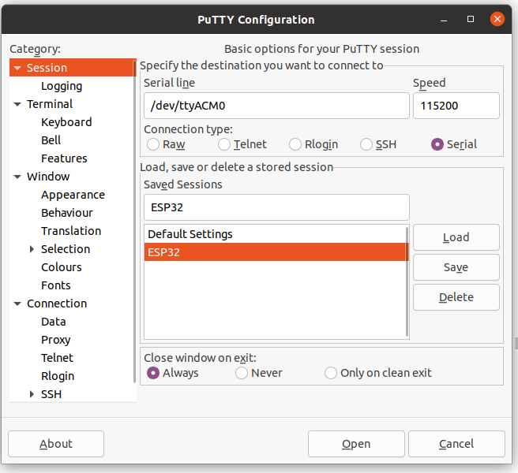
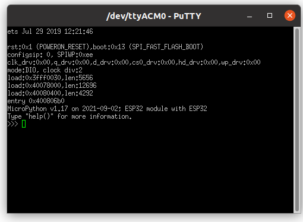

# Use Micropython on ESP32
##  Hardware
* ESP32 devlopment board
    * Modlule: ESP32-WROOM-23E
    * Chip: ESP32-D0WD-V3

# USB Connection
connect to the micro usb port of board to Laptop. A new device will be detected under:
`/dev/ttyACM0`

> Some micro usb cable may have only power function. In our case we need a micro usb cable with "data transfer" function
> If you could not see the device under /dev, check the micro usb cable or just try with another one.


## install esptool

pip install esptool
## erase flash
```
$sudo esptool.py --chip esp32s2 --port /dev/ttyACM0 erase_flash
esptool.py v3.2
Serial port /dev/ttyACM0
Connecting....

A fatal error occurred: This chip is ESP32 not ESP32-S2. Wrong --chip argument?
```
then try with `esp32`

```
$ sudo esptool.py --chip esp32 --port /dev/ttyACM0 erase_flash
esptool.py v3.2
Serial port /dev/ttyACM0
Connecting....
Chip is ESP32-D0WD-V3 (revision 3)
Features: WiFi, BT, Dual Core, 240MHz, VRef calibration in efuse, Coding Scheme None
Crystal is 40MHz
MAC: 44:17:93:5b:c4:8c
Uploading stub...
Running stub...
Stub running...
Erasing flash (this may take a while)...
Chip erase completed successfully in 0.5s
Hard resetting via RTS pin...
```

successfully!

## wirte micropython firmare
Download the firmware [v1.17 (2021-09-02) .bin](https://micropython.org/resources/firmware/esp32-20210902-v1.17.bin)

```
$sudo esptool.py --chip esp32 --port /dev/ttyACM0 write_flash -z 0x1000 esp32-20210902-v1.17.bin 
esptool.py v3.2
Serial port /dev/ttyACM0
Connecting.......
Chip is ESP32-D0WD-V3 (revision 3)
Features: WiFi, BT, Dual Core, 240MHz, VRef calibration in efuse, Coding Scheme None
Crystal is 40MHz
MAC: 44:17:93:5b:c4:8c
Uploading stub...
Running stub...
Stub running...
Configuring flash size...
Flash will be erased from 0x00001000 to 0x00175fff...
Compressed 1527504 bytes to 987584...
Wrote 1527504 bytes (987584 compressed) at 0x00001000 in 87.4 seconds (effective 139.8 kbit/s)...
Hash of data verified.

Leaving...
Hard resetting via RTS pin...
```

## add current user to `dailout` group

use `stat` to check the neccessary authorities.
```
$ stat /dev/ttyACM0 
  File: /dev/ttyACM0
  Size: 0         	Blocks: 0          IO Block: 4096   character special file
Device: 5h/5d	Inode: 918         Links: 1     Device type: a6,0
Access: (0660/crw-rw----)  Uid: (    0/    root)   Gid: (   20/ dialout)
Access: 2021-12-02 22:35:36.240109262 +0100
Modify: 2021-12-02 22:35:36.240109262 +0100
Change: 2021-12-02 22:15:15.240109262 +0100

```

Only group of `20/ dialout` could access `/dev/ttyACM0`. 

add current user to group:
```sudo usermod -a -G dialout $USER```

check the grous
```
$ groups ubuntu
ubuntu : ubuntu adm dialout cdrom sudo dip plugdev lpadmin lxd sambashare docker

```





Reference:
https://micropython.org/download/GENERIC_S2/

[解决普通用户无法访问/dev/ttyUSB0](https://github.com/Zhgong/esp32cam-micropython/blob/master/README.md#3-%E8%A7%A3%E5%86%B3%E6%99%AE%E9%80%9A%E7%94%A8%E6%88%B7%E6%97%A0%E6%B3%95%E8%AE%BF%E9%97%AEdevttyusb0)